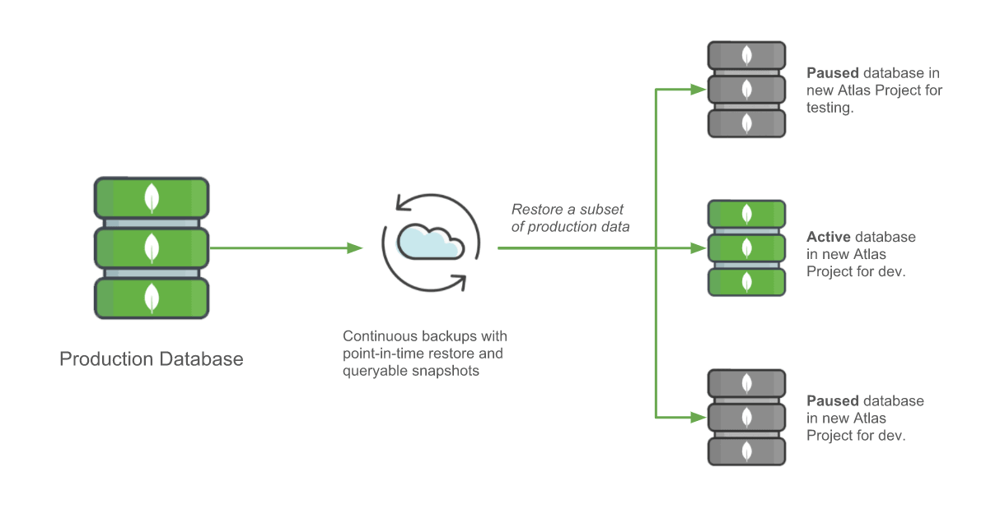
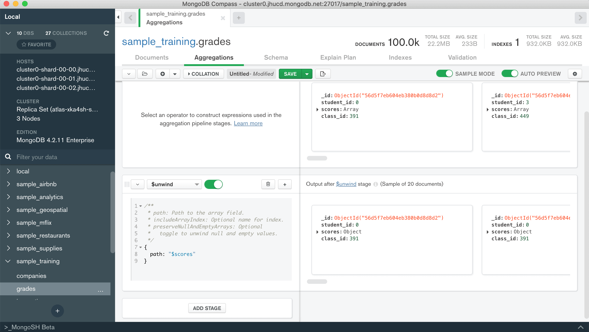
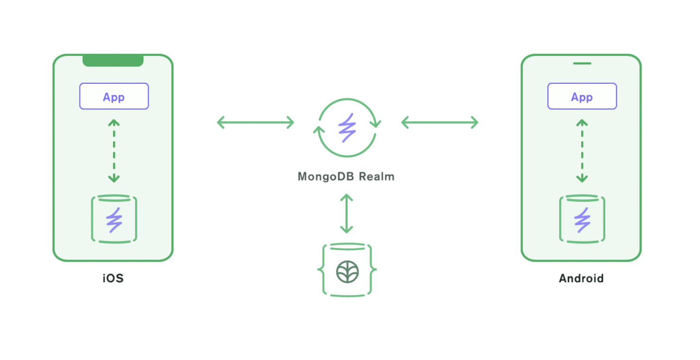
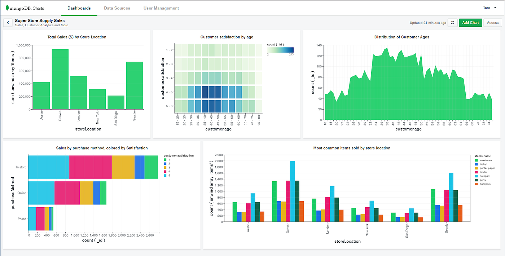
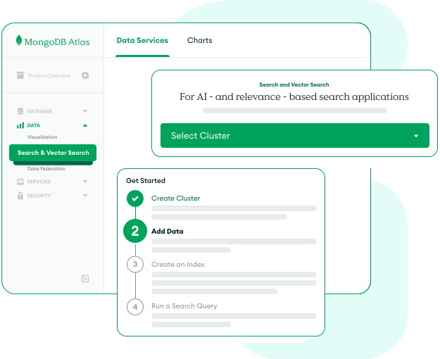

# Introduction à MongoDB

{ style="display: block; margin: 0 auto" }

---

## Contexte d'émergence du NoSQL

Les bases de données **NoSQL** ont émergé pour répondre à un double besoin :

-   **Exploiter efficacement** des données massives (Big Data)
-   **Monétiser** cette exploitation, notamment dans les entreprises technologiques

Au début des années 2000, les bases relationnelles étaient jugées **trop rigides** et leur **coût explosait** dès qu'on les utilisait sur plusieurs machines en parallèle.

Les données modernes sont très diverses :

-   Audio
-   Vidéo
-   Images
-   Coordonnées géographiques
-   Textes, etc.

---

## SQL vs NoSQL

**MongoDB** et **MySQL** sont deux systèmes de **gestion de base de données** que vous pouvez utiliser pour stocker et gérer des données. MySQL est un système de **base de données relationnelle** qui stocke les données dans un format **tabulaire structuré**. En revanche, MongoDB stocke les données sous forme de **documents JSON** dans un format plus flexible. Les deux offrent des performances et une capacité de mise à l'échelle, mais ils offrent de meilleures performances pour des cas d'utilisation différents.

### Modèle de données

MySQL est un système de base de données relationnelle qui stocke les données dans des colonnes, des lignes et des tableaux. Vous stockez les données dans des lignes, chaque colonne représentant un type de données différent. Vous définissez ensuite les relations entre les données à l'aide de clés étrangères et de clés primaires. Chaque tableau possède une clé primaire que vous utilisez pour l'identifier, la clé étrangère créant une relation.

MongoDB est une base de données orientée document qui stocke toutes ses données sous forme de documents binaires JSON (BSON). BSON vous permet de sérialiser de nombreuses formes de données. L'utilisation de documents BSON vous permet de stocker des données non structurées, semi-structurées et structurées. Au lieu d'un schéma de base de données, MongoDB utilise une approche flexible et stocke les documents dans des collections.

---

## Qu’est-ce que MongoDB ?

### Les produits MongoDB

#### MongoDB

Le cœur de métier de MongoDB est sa technologie de base de données NoSQL orientée documents. Elle est aujourd’hui utilisée dans plus de 100 millions de projets.

#### MongoDB Atlas

MongoDB Atlas est la solution cloud de Database as a Service (DBaaS). Atlas vous déploie un serveur MongoDB managé sur un cloud Amazon Web Services, Google Cloud Platform ou Microsoft Azure, dans la région de votre choix. Vous aurez le choix de la taille de votre cluster tout en ayant l’avantage d’avoir votre base de données managée par l’équipe d’ingénieurs de MongoDB.

*Schéma de présentation MongoDB Atlas :*
{ style="display: block; margin: 0 auto" }

***Atlas propose même un plan gratuit pour 500MB, idéal pour vos projets perso ou pour expérimenter.***

#### MongoDB Compass

MongoDB Compass est le client officiel développé par MongoDB. Cet outil complet va vous permettre de consulter, modifier, exécuter des requêtes ou des agrégations sur votre base de données locale ou cloud directement depuis son interface graphique. Le travail des designers Mongo offre une expérience utilisateur et une interface agréable pour manipuler vos données.

*Interface MongoDB Compass :*
{ style="display: block; margin: 0 auto" }

#### MongoDB Realm

Realm est une base de données allégée embarquée sur le client mobile. Dans le cas d’une application mobile, Realm vous permet de stocker une partie de la donnée directement sur l’appareil et de coordonner des synchronisations avec la base de données principale suivant différents événements. C’est idéal pour éviter des requêtes réseau et permettre une meilleure utilisation hors ligne de l’application.

*Schéma MongoDB Realm :*
{ style="display: block; margin: 0 auto" }

#### MongoDB Charts

Charts est le moyen de créer des graphiques pour visualiser votre donnée directement depuis MongoDB. Vous pourrez créer plusieurs types de graphiques en vous basant sur la donnée que vous avez sur votre cluster Atlas et les intégrer directement sur votre site directement en HTML. Charts permet d’exploiter vos données rapidement sans avoir à développer une interface Frontend spécifique pour ce besoin.

*Exemple de graphiques avec MongoDB Charts :*
{ style="display: block; margin: 0 auto" }

#### Cloud Manager

Cloud Manager est un outil complet de monitoring et d’optimisation de performance pour un cluster sur MongoDB Entreprise Advanced. Vous avez accès à une douzaine d’indicateurs à travers votre base de données afin d’analyser les performances de comprendre les requêtes effectuées par votre application. Un système d’alerte peut être configuré pour vous prévenir d’urgences et se connecte nativement sur Slack, DataDog ou PagerDuty.

#### Atlas Search

Atlas search a pour but de concurrencer Algolia et ElasticSearch sur le terrain des moteurs de recherche. Il permet d’indexer sa donnée différemment afin de pouvoir avoir une fonction de recherche plus fine et plus intelligente qu’une simple requête avec filtres.

*Atlas Search :*
{ style="display: block; margin: 0 auto" }

### Les atouts techniques de MongoDB

#### Vitesse de lecture

##### Duplication de la donnée

Depuis des années, la bonne pratique en SQL était la n**ormalisation des données**. Afin d’assurer la meilleure fiabilité des données, il fallait éviter la **duplication** et faire référence à une autre table contenant les définitions. Par exemple, dans un outil de gestion de clients, on trouverait une table adresse et une table ville. La table adresse utiliserait une clé étrangère pour faire référence à une ville plutôt que de saisir la ville dans la table adresse.

**Table clients** :

| **ID**|**Clients**|**Ville**|
|:-:    |:-:        |:-:      |
|1      |Jean       |1        |
|2      |Marie      |2        |
|3      |Vivien     |1        |

**Table Ville** :

| **ID**|**Villes**|
|:-:    |:-:        |
|1      |Pantin     |
|2      |Paris      |

Ce paradigme permettait d’éviter de la **duplication de donnée** et permettait d’éviter les **erreurs de saisie**, comme par exemple une faute de frappe ou une casse différente qui rendrait l’analyse fausse. Il était aussi dû à des **contraintes matérielles** historiques d’une époque révolue où les infrastructures étaient en premise et le **coût de stockage** plus élevé qu’aujourd’hui.

**MongoDB a fait le choix contraire d’encourager la duplication des données.**

En effet, en SQL comme en Mongo, **les requêtes les plus lentes** sont celles qui **impliquent des références à d’autres tables** ou **d’autres collections**.

Aujourd’hui, le **coût de stockage étant bien plus faible** et l’infrastructure distribuée étant bien prise en charge par MongoDB, il y a beaucoup moins de problèmes à dupliquer la donnée.

Bien qu’il soit **possible de faire référence à d’autres documents** dans Mongo, il est **encouragé d’écrire le maximum de donnée** au sein d’un document. La **limite** d’un document étant de **16Mo**, **l’utilisation de la référence** trouve son intérêt lorsqu’un document devient **trop lourd** pour tout inclure.

Prenons l’exemple d’un blog utilisant une base de données MongoDB. Là où nous serions tentés d’avoir une **collection Posts** et une **collection Comments**, Mongo nous **encourage à inclure les commentaires dans le post**. Il n’y a pas d’usages où nous aurions besoin de charger les commentaires sans les posts donc il est tout à fait possible d’imbriquer les commentaires dans le document d’un article du blog.

Cette imbrication permet à MongoDB d’améliorer ses **performances de lecture** en ne lisant **qu’un document** plutôt **qu’à devoir en parcourir plusieurs** et **rassembler un objet** pour le livrer au serveur.

##### Diversité des types index

Au cœur de sa vitesse de lecture réside la **diversité des index proposés**. L’**utilisation** et la **combinaison** de ces index permettent à vos requêtes de parcourir un échantillon de la donnée au lieu d’effectuer la recherche sur l’ensemble de la collection. MongoDB offre la possibilité d’indexer un objet sur plusieurs champs, d’indexer un champ contenant un tableau d’éléments, d’indexer des coordonnées GPS et d’indexer un bloc de texte pour pouvoir faire une recherche dans son contenu.

Comme pour toute base de données, multiplier les index entraîne une **augmentation de la taille** de la base et un ralentissement des opérations d’écriture. Il est donc essentiel de définir une stratégie d’indexation efficace, visant à limiter leur nombre tout en assurant une couverture optimale des requêtes de l’application.

#### Performances à l’écriture

Comme on a pu le voir plus haut, **un cluster** de base de données MongoDB est **répliqué plusieurs fois**, avec **une base primaire** et **des répliques** considérées comme secondaires. MongoDB peut présenter des performances intéressantes même à l’écriture grâce à la notion de Write concerns. Plus une base est répliquée et/ou shardée (la notion de sharding est expliquée ci-dessous), plus MongoDB doit aller écrire la donnée à différents endroits.

Le **write concern** est la notion de confirmation d’écriture. Par défaut, le write concern est défini à 1, c’est-à-dire que lors d’une écriture, **MongoDB va écrire la donnée une première fois** sur la base de données primaire et vous retourner sa confirmation. Elle se chargera, en tâche de fond, de coordonner les réplications.

Suivant vos besoins, vous pourriez **augmenter le write concern** si vous voulez vous assurer que la donnée a été **répliquée sur les bases de données secondaires** de votre cluster, ou au contraire le **réduire à zéro** pour désactiver cet accusé d’écriture en base et augmenter d’autant plus la performance.

#### Haute Disponibilité

En informatique comme dans la vie, la seule certitude est que quelque chose va mourir.

Partant de ce constat et du positionnement **Cloud first**, MongoDB fait le choix de répliquer votre base de données en plusieurs serveurs mongod. Un primaire et plusieurs répliques (cela n'empêche pas une utilisation single node pour votre application).

Si votre machine (virtuelle) hébergeant le serveur MongoDB venait à **être défectueuse**, votre donnée reste très **rapidement accessible** grâce **aux répliques** disponibles. La VM défectueuse serait supprimée et un nouveau **Leader** émergerait pendant qu’une **nouvelle réplique** serait en cours de création.

Côté application, votre driver MongoDB va être en mesure d’attendre la réponse à sa première tentative d’écriture, puis de la retenter s’il le faut pour s’assurer que les opérations d’ajout ou de modification de données sont bien prises en compte.

Cette réplication permet à votre base de données d’être en permanence disponible.

#### Scalabilité

La méthode la plus facile pour **scaler une base de données** est le **scaling vertical**, qui consiste à rendre **la machine hébergeant** la base de données **plus puissante** en ajoutant de la RAM, de l’espace disque et de la puissance CPU. Cette méthode est vite coûteuse car plus les composants sont puissants ou avec une grosse capacité, plus ils sont chers.

L’autre méthode consiste à **scaler horizontalement**, en ajoutant **plus de machines** pour héberger la même base de données. Cette méthode est **plus compliquée** car jusque-là les bases **SQL perdaient en performances** lors de requêtes qui impliquaient plusieurs machines.

MongoDB propose la notion de **Sharding**. Cette méthode permet de di**stribuer la data** à travers p**lusieurs machines** afin d’optimiser les performances des requêtes entrantes. **La donnée va être répartie** à travers différents fragments de la base de données et en utilisant un **Shard Key**, les requêtes mongo vont être très efficaces pour aller récupérer de la donnée directement dans le fragment qui la contient.

#### Flexibilité

Contrairement aux bases SQL, une base MongoDB **n’a pas forcément besoin d’avoir une structure de donnée fixe** pour l’ensemble des objets présents dans une collection.

En effet, en SQL si vous souhaitez ajouter une colonne à votre table Clients, il faudra faire une migration pour ajouter une colonne et cette propriété sera NULL pour tous les clients n’ayant pas ce champ renseigné.

Avec MongoDB, vous pouvez faire du **Schemaless**. Un client pourra avoir le champ « FAX » parce qu’il est un des derniers spécimens sur terre à posséder une telle machine sans pour autant que tous les clients aient à avoir cette propriété.

Le fait de proposer du Schemaless permet un **changement rapide**.

Ça paraît essentiel mais toute application a besoin d’itérer sur ses fonctionnalités afin d’innover. Ce changement est facile au début, quelle que soit la technologie de base de données choisie.

En revanche, les migrations SQL peuvent être longues, et nécessiter du temps d’indisponibilité de l’application, ce qui est coûteux pour une entreprise qui risque de perdre des clients.

### Les fonctionnalités incontournables

#### Les agrégations

Le but de toute base de données est de **stocker** et **ordonner** de la donnée en vue de pouvoir **l’exploiter**. Pour pouvoir exploiter ces données, MongoDB propose des **opérateurs d’agrégations**.

Les agrégations sont des séries d’opérations de manipulation sur une donnée en vue de produire un document spécifique. Elles permettent d’extraire certaines données d’objets, de les grouper, de les assembler dans un nouveau format afin de pouvoir récupérer la donnée structurée comme on le souhaite.

#### La recherche textuelle

**L’index Text** de MongoDB permet aux utilisateurs de **rechercher spécifiquement** du **texte** à l’intérieur d’un objet. Par exemple pour rechercher un **mot-clé** dans une série d’articles de blog ou un **mot** spécifique dans une fiche article pour un site e-commerce.

#### Les coordonnées GPS

MongoDB propose également des **index Géospatiaux** qui permettent de définir un point via des **coordonnées GPS**, ou une **aire**, à partir d’un point central et d’un rayon ou bien à partir de plusieurs points afin de définir une zone spécifique.

Cette fonctionnalité est utile pour stocker des lieux et calculer la distance entre plusieurs points.

#### Les transactions

MongoDB garde la réputation qu’il n’est pas possible de faire une opération de transaction et qu’il faut privilégier une base SQL dans le cas où c’est une fonctionnalité essentielle à votre application.

**Qu’est-ce qu’une transaction ?**
Par exemple, lorsqu’un virement bancaire a lieu, il faut absolument que l’argent sur le compte A soit déduit ET qu’il soit crédité sur le compte B. Si l’opération d’écriture échouait en plein milieu, le compte A se retrouverait débité, le compte B ne serait pas crédité et le montant transféré serait perdu dans la nature. Lors d’une transaction, si l’opération n’est pas complètement terminée, la base de données effectue un **rollback** avant de signaler l’erreur.

### Les limites de MongoDB

Toutes ces belles fonctionnalités de MongoDB semblent faire d’elle une techno à toute épreuve. Or dans la tech, la seule vérité est qu’il n’y a pas de techno parfaite. Toute fonctionnalité vient en échange d’un coût.

#### La dénormalisation à outrance

Comme on l’a vu, MongoDB incite à la **dénormalisation**. Que ce soit dans la documentation ou les ressources de formation officielle de MongoDB University, il vous est encouragé de dupliquer votre donnée dans la mesure du possible.

Bien que ça paraisse pertinent au vu des faibles coûts des capacités de stockage aujourd’hui, cette duplication va créer un nouveau problème: **l’intégrité des données**.

Imaginez qu’il faille **mettre à jour plusieurs collections** à chaque fois qu’un utilisateur va corriger son adresse. Cette complexité s’ajoute **à la charge des développeurs** qui, à chaque fois qu’ils vont toucher une fonctionnalité qui fait référence aux adresses, vont devoir se charger de coordonner l’update dans toutes les collections.

#### Les jointures

Les **jointures** ont été introduites dans MongoDB avec l’agrégat *$lookup*. Cette fonctionnalité vient répondre aux besoins dans les cas où la **dénormalisation** n’est pas une option et qu’il n’y a pas d’autre choix que de **créer une référence** à un autre objet.

Or mongoDB **n’a pas été conçu** pour ce type de besoin et les performances d’une requête avec un agrégat $lookup sont bien moins intéressantes. Vous perdez l’avantage initial que propose MongoDB.

Si votre application a besoin de **mettre en relation beaucoup de données**, le choix de MongoDB n’est peut-être **pas le bon**.

#### La surindexation

MongoDB plaît par ses **performances**. Or pour arriver à ces performances sur un maximum de requêtes, vous serez incité à **créer de plus en plus d’index**.

Cette **surindexation** va taxer les performances à l’écriture de votre base de données.

Chaque ajout d’un objet dans la collection va nécessiter une création d’une multitude d’index dans plusieurs collections, ce qui va être **gourmand en ressources** de votre base de données.

### Alors pourquoi s’intéresser à MongoDB ?

#### Compétence recherchée

Le **succès** qu’a connu MongoDB auprès des développeurs s’est également retrouvé au sein des projets d’entreprises. Aujourd’hui, on retrouve des projets utilisant MongoDB dans des **Startups**, des **grands groupes**, des projets **gouvernementaux** et des **associations**.

Parmi les utilisateurs Français de MongoDB on retrouve entre autre *AXA*, **Bouygues Telecom** et **Leroy Merlin**.

#### Qui devrait apprendre à utiliser MongoDB ?

**Tout développeur Backend**, quelle que soit la techno utilisée aurait intérêt à se former sur les bases de MongoDB. Apprendre à créer une base de données et faire les premières requêtes CRUD est suffisant dans un premier temps si vous n’avez pas de projet pour le mettre en application.

**Les développeurs Fullstack JavaScript** ont également beaucoup à y gagner. Les stacks employés pour les projets JavaScript utilisent plus souvent MongoDB. C’est une compétence qui vous sera probablement plus demandée qu’un **développeur PHP**.

MongoDB sera donc très performant avec des **applications à fort traffic** (e-commerce, réseaux sociaux, etc), les **applications géospatiale**s (Uber, Deliveroo, Maps, etc), les **applications de journalisation** (centralisation de logs, systèmes de monitoring, traces d’événements utilisateur, etc) et les **applications en évolution rapide** (MVP, startups, etc)

---

## Lexique MongoDB vs SQL

| Terme      | MongoDB                          | SQL (comparaison)      |
| ---------- | -------------------------------- | ---------------------- |
| Base       | Base de données                  | Base de données        |
| Collection | Ensemble de documents            | Table                  |
| Document   | Enregistrement individuel (JSON) | Ligne / enregistrement |

---

## Installation 

Pour la suite, il va nous falloir installer MongoDB. Suivez le lien d'installation suivant !
👉 [Intallation MongoDB](https://www.mongodb.com/docs/manual/installation/)

---

👉 [Documentation officiel mongodb](https://www.mongodb.com/docs/)

---

*Sources :*
*- Julien POIRIER*
*- welovedevs*
*- mongodb*
*- wikipedia*