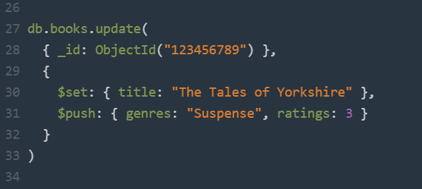

# MongoDB Query

{ style="display: block; margin: 0 auto" }

Cette partie du cours traite des **Mongodb queries** pour opérer directement sur la base de données mongo via le *shell*, un *mongodb client* ou un app N*odeJS* avec *MongoClient*. Avant d’aller plus loin, il faut préalablement avoir installé mongodb (voir guide d’installation [Windows](https://www.mongodb.com/docs/manual/tutorial/install-mongodb-on-windows/), [Mac](https://www.mongodb.com/docs/manual/tutorial/install-mongodb-on-os-x/) ou Linux) et créé une base de données. Une base de donnée d'exercice est fournis dans le dossier ;) .

---

## Requêtes de sélection (Queries de sélection)

Les requêtes de sélection permettent de retrouver un ou plusieurs documents dans une collection MongoDB en fonction de critères précis.

*Syntaxe de base* :
```js
db.nom_de_la_collection.find({ critère })
```

### *pretty()* dans MongoDB

La méthode *.pretty()* est utilisée dans **MongoDB Shell** (ou **mongosh**) pour afficher les résultats d'une requête au format lisible (indenté et structuré), comme du JSON bien formaté.

**Exemple sans .pretty() :**
```js
db.products.find()
```
Renverra des **résultats sur une seule ligne**, **difficile à lire** si les documents sont **longs** ou **imbriqués** :
```json
{ "_id": ObjectId("..."), "name": "Chaise", "price": 49.99, "stock": 12, ... }
{ "_id": ObjectId("..."), "name": "Canapé", "price": 199.99, "stock": 3, ... }
```

**Exemple avec .pretty() :**
```js
db.products.find().pretty()
```
Renverra des **résultats indentés**, **faciles à lire**, très utile surtout quand on a **des objets** ou **tableaux imbriqués** :
```json
{
  "_id": ObjectId("..."),
  "name": "Chaise",
  "price": 49.99,
  "stock": 12
}
{
  "_id": ObjectId("..."),
  "name": "Canapé",
  "price": 199.99,
  "stock": 3
}
```

Dans **MongoDB Compass**, les résultats sont déjà formatés joliment, donc .pretty() **n’est pas nécessaire**.

### Requête basique

Par exemple, une query qui retournerais tous les documents d'une collection *users* :
```js
db.users.find( {} )
```
C'est l'équivalent de la requette SQL suivante :
```sql
SELECT * FROM users;
```

### Spécifier une condition d'égalité

Pour spécifier une condition d'égalité, on utilise des expressions de la forme :
```js
{ <champ>: <valeur> }
```
C’est-à-dire que le champ doit correspondre exactement à la valeur indiquée.

*Exemple* :
```js
db.users.find({ firstname: "Vincent" })
```
La requête sélectionne tous les documents de la collection users dont le champ status vaut *"Vincent"*.
Cette requête utilise un filtre :
```js
{ firstname: "Vincent"}
```
Ce qui équivaut à la requête SQL suivante :
```sql
SELECT * FROM users WHERE firstname = "Vincent";
```

### Spécifier des conditions à l’aide des opérateurs de requête

Un **query filter document** peut utiliser des opérateurs de requête pour définir des conditions, sous la forme suivante :
```js
{ <champ>: { <opérateur>: <valeur> }, ... }
```
#### $in ()

La requête suivante récupère tous les documents de la collection *users* dont le champ *firstname* est égal à "Vincent" ou "Maurice" :
```js
db.users.find({ firstname: { $in: [ "Vincent", "Maurice" ] } })
```

⚠️ **Remarque** :
Bien qu’on puisse écrire cette requête en utilisant l’opérateur **$or**, il est préférable d’utiliser **$in** lorsqu’on vérifie plusieurs valeurs possibles d’un même champ. C’est **plus lisible** et souvent **plus performant**.

#### $gt - Greater Than (sypérieur à)
$gte - supérieur OU = à
$lte - inférieur OU = à
Permet de sélectionner les documents où la valeur d’un champ est strictement supérieure à une certaine valeur.

Par exemple *rechercher les articles dont le montant est supérieur à 100000 :*
```js
db.orders.find({ amount: { $gt: 100000 } })
```

Équivalent SQL :
```sql
SELECT * FROM orders WHERE amount > 100000
```

#### $lt - Less Than (inférieur à)

Permet de filtrer les documents dont la valeur d’un champ est inférieure à une certaine valeur.

Par exemple *rechercher les articles dont les taxes sont inférieurs à 5000 :*
```js
db.orders.find({ taxes: { $lt: 5000 } })
```

Équivalent SQL :
```sql
SELECT * FROM orders WHERE taxes < 5000
```

#### $and (Et logique)

Permet de combiner plusieurs conditions. Toutes doivent être vraies pour qu’un document soit sélectionné.

Par exemple *rechercher les commandes dont le client est "Chiofalo Vincent" et le montant supérieur à 100000 :*
```js
db.orders.find({
  $and: [
    { client: "Chiofalo Vincent" },
    { amount: { $gt: 100000 } }
  ]
})
```

Équivalent SQL :
```sql
SELECT * FROM orders WHERE client = "Chiofalo Vincent" AND amount > 100000
```

#### $or (Ou logique)

Permet de filtrer les documents qui satisfont au moins une des conditions spécifiées.

Par exemple *rechercher les commandes soit d’un certain client, soit avec un montant élevé :*
```js
db.orders.find({
  $or: [
    { client: "Chiofalo Vincent" },
    { amount: { $gt: 100000 } }
  ]
})
```

SQL équivalent :
```sql
SELECT * FROM orders WHERE client = "Chiofalo Vincent" OR amount > 100000
```

### Pour aller plus loin

#### $exists (présence d’un champ)

Permet de vérifier si un champ existe ou non dans un document.

Par exemple *rechercher les documents qui ont un champ taxes :*
```js
db.orders.find({ taxes: { $exists: true } })
```

Équivalent SQL (approximatif) :
```sql
SELECT * FROM orders WHERE taxes IS NOT NULL
```

On peut aussi vérifier l'absence :
```js
db.orders.find({ taxes: { $exists: false } })
```

#### $regex (Filtrer avec une expression régulière)

Permet de faire une recherche textuelle partielle (comme un LIKE en SQL).

Par exemple *rechercher tous les clients dont le nom commence par "Chi" :*
```js
db.orders.find({ client: { $regex: /^Chi/ } })
```

SQL équivalent :
```sql
SELECT * FROM orders WHERE client LIKE 'Chi%'
```

#### $elemMatch (Filtrer dans un tableau d’objets)

Permet de rechercher un élément spécifique dans un tableau complexe (tableau d’objets).

Par exemple *rechercher les commandes où un article a pour sku "27' 4K Monitor" et un prix supérieur à 50000 :*
```js
db.orders.find({
  items: {
    $elemMatch: {
      sku: "27' 4K Monitor",
      price: { $gt: 50000 }
    }
  }
})
```
Cela garantit que le même objet dans le tableau items respecte les deux conditions.

En SQL, on se retrouverais avec des tables relationnelles.

#### $size (Taille d’un tableau)

Permet de filtrer les documents dont un tableau contient exactement un certain nombre d’éléments.

Par exemple *rechercher les commandes avec exactement 2 articles :*
```js
db.orders.find({ items: { $size: 2 } })
```

#### Combiner des opérateurs

Il est possible de combiner tous ces opérateurs ensemble, par exemple :
```js
db.orders.find({
  $and: [
    { client: { $regex: /^Chi/i } },
    { "items": { $elemMatch: { price: { $gte: 50000 } } } }
  ]
})
```

### Encore plus loin (bonus)

| Mots clés          | Concepts clés              | Liens                      |
| ------------------ | -------------------------- | -------------------------- |
| `$lookup`          | Jointure entre collections | [Documentation jointure (lookup)](https://www.mongodb.com/docs/manual/reference/operator/aggregation/lookup/) |
| `$unwind`          | Dénormalisation de tableau | [Documentation aggrégation (unwind)](https://www.mongodb.com/docs/manual/reference/operator/aggregation/unwind/) |
| `$group`           | Agrégation/statistiques    | [Documentation aggrégation (group)](https://www.mongodb.com/docs/manual/reference/operator/aggregation/group/) |
| `$dateToString`    | Manipulation de dates      | [Documentation aggrégation (dateToString)](https://www.mongodb.com/docs/v8.0/reference/operator/aggregation/dateToString/) |
| `$sort` | Résultats ordonnés         | [Documentation aggrégation (sort)](https://www.mongodb.com/docs/manual/reference/operator/aggregation/sort/) |
| `$limit`  | Résultats ordonnés         | [Documentation aggrégation (limit)](https://www.mongodb.com/docs/manual/reference/operator/aggregation/limit/) |

### Résumé simple

| Opérateur    | Description                                         | Exemple                                                                       | Équivalent SQL                     |
| ------------ | --------------------------------------------------- | ----------------------------------------------------------------------------- | ---------------------------------- |
| `$eq`        | Égal à                                              | `{ status: "D" }`                                                             | `= 'D'`                            |
| `$gt`        | Supérieur à                                         | `{ amount: { $gt: 100000 } }`                                                 | `> 100000`                         |
| `$lt`        | Inférieur à                                         | `{ taxes: { $lt: 5000 } }`                                                    | `< 5000`                           |
| `$in`        | Inclus dans une liste de valeurs                    | `{ status: { $in: ["A", "D"] } }`                                             | `IN ('A', 'D')`                    |
| `$and`       | Toutes les conditions doivent être vraies           | `{ $and: [ { client: "Vincent" }, { amount: { $gt: 1000 } } ] }`              | `AND`                              |
| `$or`        | Au moins une condition doit être vraie              | `{ $or: [ { client: "Vincent" }, { amount: { $gt: 1000 } } ] }`               | `OR`                               |
| `$exists`    | Vérifie si un champ existe ou non                   | `{ taxes: { $exists: true } }`                                                | `IS NOT NULL` (approximatif)       |
| `$regex`     | Recherche textuelle avec expression régulière       | `{ client: { $regex: /^Chi/i } }`                                             | `LIKE 'Chi%'`                      |
| `$elemMatch` | Condition multiple sur un même élément d’un tableau | `{ items: { $elemMatch: { sku: "27' 4K Monitor", price: { $gt: 50000 } } } }` | N/A (pas équivalent direct en SQL) |
| `$size`      | Nombre exact d’éléments dans un tableau             | `{ items: { $size: 2 } }`                                                     | N/A                                |

$in === qd sur même champ
SINON $or   (pour 2 champs différents)

### Installation

Avant de pratiquer avec MongoDB, il va nous falloir l'installer. Allez au fichier [install.md](install.md)

### Exercices

Faites les exercices de **niveau 1** et de **niveau 2** (**niveau 3 bonus** - *correction fournis en fin module*) du fichier [exo-queries.md](exo-queries.md)

---

## CRUD

Il s’agit opérations de création d’un ou plusieurs documents sur la base mongo.

### Création de database MongoDB

Pour créer une base de donnée MongoDB, il suffit, dans un **mongo shell**, de taper :
```shell
use <nom_de_la_db>
```

Cela permet de la crée si elle n’existe pas déjà.

### Création de documents

Pour créer un (ou des) document(s) dans une collection, il existe deux méthodes :

- **insertOne**
```js
db.posts.insertOne({ subject: "Blog Post", content: "Lorem Ipsum" })
```

- **insertMany**
```js
db.posts.insertMany([
{ subject: "Blog Post 1", content: "Lorem Ipsum" },
{ subject: "Blog Post 2", content: "Lorem Ipsum bis" },
{ subject: "Blog Post 3", content: "Lorem Ipsum ter" },
{ subject: "Blog Post 4", content: "Lorem Ipsum etc" },])
```
De la même façon que pour la base de données, si la collection n’existe pas en amont de la création, cette mongodb query va la créer pour vous.

En MongoDB, une opération de création est **atomique** au niveau d’un seul document. Cela signifie que dans le cas d’un *insertMany*, si l’opération échoue en cours d’exécution, **les documents insérés avant l’erreur restent enregistrés** dans la base de données. Ainsi, l’insertion n’est pas totalement atomique sur l’ensemble des documents. Toutefois, depuis la version 4.0, MongoDB prend en charge l’atomicité multi-documents grâce aux transactions, permettant d'assurer que plusieurs opérations soient exécutées de manière totalement atomique.

Note : il existe également la mongodb query ```insert``` qui peut insérer un ou plusieurs documents dans la collection. On évite généralement de l'utiliser.

### Lecture de documents

Voici une liste de requêtes MongoDB que vous pouvez utiliser pour retrouver vos documents dans votre base de données :

- **find**
```js
db.posts.find({ })
```
(posts pris en ex, ça peut être users == 1 fichier d'une collection)

Cette requête permet de **récupérer l’ensemble des posts** présents dans la base de données. Toutefois, elle ne doit être utilisée que **si la collection contient un faible nombre de documents**. Dès que **le volume de données augmente**, il devient essentiel d'ajouter **une limite** et **une pagination** à chaque chargement. En effet, **récupérer une trentaine de documents** en une seule requête MongoDB **est raisonnable**, mais tenter d’en charger **50 000 d’un coup** pourrait **dépasser les capacités de votre serveur** et **entraîner des erreurs**.

- **findOne**
```js
db.posts.findOne({ subject: "Blog Post 1"})
```
Cette requête MongoDB renverra **un seul document** : le premier qui correspond aux **critères spécifiés** entre les accolades. Pour garantir de bonnes performances, il est important de **créer des index** sur les champs utilisés dans vos recherches. Cela permet **d’optimiser la rapidité d’exécution des requêtes**, en particulier lorsque la collection contient un grand nombre de documents.

### Mettre à jour les données

Pour mettre à jour un (ou des) document(s) dans une collection, il existe plusieurs méthodes :

- **updateOne**
```js
db.posts.updateOne(
  { subject: "Blog Post 1" },
    [
      { $set: { "category": "technology", lastUpdate: "$$NOW"} }
    ]
)
```
Dans cet exemple, nous allons mettre à jour le post dont le titre est « Blog Post 1 » en lui ajoutant les champs *category* et *lastUpdate*, en utilisant un pipeline d’agrégation. C'est la méthode que l'on **va privilégier**.

- **findOneAndUpdate**
```js
db.posts.findOneAndUpdate(
  { subject: "Blog Post 1" },
  [
    { $set: { category: "technology", lastUpdate: "$$NOW" } }
  ],
  { returnDocument: "after" } // Pour retourner le document mis à jour (équivalent à { returnNewDocument: true } dans d'anciennes versions)
)
```
Lorsque l'on utilise *findOneAndUpdate* avec un pipeline de mise à jour (défini à l'aide de crochets [ ]), on bénéficie de la puissance des expressions d’agrégation, ce qui permet notamment d’accéder à des variables système comme **$$NOW** pour enregistrer automatiquement la date et l’heure de la mise à jour. Cette méthode est particulièrement utile lorsqu'on souhaite non seulement **modifier un document**, mais également **le récupérer immédiatement** après modification. Pour cela, l'option *returnDocument: "after"* permet de spécifier que le document retourné doit être celui mis à jour (et non sa version antérieure). Ainsi, *findOneAndUpdate* s'avère être une alternative idéale à updateOne lorsqu’on a besoin d’une **mise à jour** combinée à une r**écupération immédiate du document** concerné.

- **updateOne**
```js
db.posts.findAndModify({
  query: { subject: "Blog Post 1" },
  update: [
    { $set: { category: "technology", lastUpdate: "$$NOW" } }
  ],
  new: true // Pour retourner le document mis à jour
})
```

La méthode *findAndModify* de MongoDB, bien que plus ancienne, permet elle aussi d'effectuer une mise à jour sur un document tout en le retournant dans la même opération. Depuis MongoDB 4.2, *findAndModify* prend en charge les pipelines d’agrégation dans la clause *update*, ce qui autorise l’usage d'expressions avancées comme **$$NOW** pour insérer dynamiquement la date et l'heure de la mise à jour. Pour que le document retourné reflète bien les modifications appliquées, il suffit d'ajouter l’option *new: true*. Cette méthode reste une alternative fonctionnelle à *findOneAndUpdate*, surtout dans des environnements ou des outils qui l'utilisent encore par défaut.

- **updateMany**
```js
db.posts.updateMany(
  { subject: $exists },
  [ 
    { $unset: "category"},
    {$set: {tags:['technology']} }
  ]
)
```
Avec cette méthode, on va pouvoir m**ettre à jour plusieurs documents**. Dans ce cas, nous allons mettre à jour tous les posts ayant un champ « subject » en retirant la propriété « category » et en rajoutant la propriété ```{ tags: ['technology'] }```.

- **replaceOne**
```js
db.posts.replaceOne(
  { subject: "Blog Post 1" },
  {
    subject: "Blog Post 1",
    category: "technology",
    lastUpdate: new Date()
  }
)
```
⚠️ Contrairement à *updateOne*, *replaceOne* remplace entièrement le document (sauf _id, qui est conservé si tu ne le précises pas).

La méthode *replaceOne* de MongoDB est utilisée lorsqu’on souhaite** remplacer entièrement un document** correspondant à un critère de recherche, plutôt que d’en modifier partiellement certains champs. Contrairement aux méthodes *updateOne* ou *findOneAndUpdate*, *replaceOne* ne permet pas l'utilisation d'opérateurs comme **$set** ni de pipelines d'agrégation : **le document de remplacement doit être complet**. Il est donc essentiel de reconstruire l'intégralité du document, **y compris les champs non modifiés**, pour éviter toute perte de données. **L'ajout de champs dynamiques**, comme une date de mise à jour, se fait en générant leur valeur côté application, par exemple avec *new Date()* en JavaScript. Cette méthode est particulièrement utile lorsqu’un document doit être **totalement mis à jour** à partir d’une nouvelle source de données.

- **l’upsert**
Les trois mongodb queries permettant l’update d’un document disposent également de l’option « upsert ». L’upsert permet de créer un document si celui qui est ciblé dans la requête d’update n’existe pas.

Pour l’activer, il suffit de passer l’option comme suit :
```js
db.posts.updateOne(
  { subject: "Blog Post 1" },
  { subject: "Blog Post" },
  { upsert: true }
)
```

### Mettre à jour les données supprimer les données

Pour créer un (ou des) document(s) dans une collection, il existe deux méthodes :

- **deleteOne**
```js
db.posts.deleteOne({
  category: "technology",
  status: "published"
})
```
La méthode *deleteOne* de MongoDB permet de **supprimer le premier document qui correspond au filtre spécifié**. Cette opération est simple et rapide : elle **ne retourne pas directement le document supprimé**, mais **un résultat indiquant si la suppression a bien eu lieu**, **ainsi que le nombre de documents supprimés**. Contrairement aux méthodes de mise à jour comme *findOneAndUpdate*, *deleteOne* ne **permet pas de récupérer** le contenu du document supprimé en une seule opération. Elle est particulièrement utilisée lorsqu’on souhaite **effacer une entrée spécifique** dans une collection sans avoir besoin de **manipuler** ou de **renvoyer** le document supprimé.
---

- **deleteMany**
Pour effacer toute une collection :
```js
db.posts.deleteMany({})
```
Pour effacer uniquement les documents suivant certains critères :
```js
db.posts.deleteMany({ tags : "technology" })
```
La méthode *deleteMany* de MongoDB permet de **supprimer tous les documents qui correspondent au critère de filtre fourni**. Contrairement à *deleteOne*, qui **supprime uniquement le premier document correspondant**, *deleteMany* agit sur **tous les documents correspondants**, ce qui est utile pour effectuer des **nettoyages massifs** dans une collection. Cette opération **ne retourne pas** les documents supprimés, mais un **résultat contenant le nombre total de documents effacés**. Elle est idéale lorsqu’on souhaite supprimer plusieurs entrées liées à un même critère sans récupérer leur contenu.

### Exercices

Faites les exercices de **niveau 1** (**niveau 2 bonus** - *correction fournis en fin module*) du fichier [exo-crud.md](exo-crud.md)

---

*Sources :*
*- mongodb*
*- welovedevs*