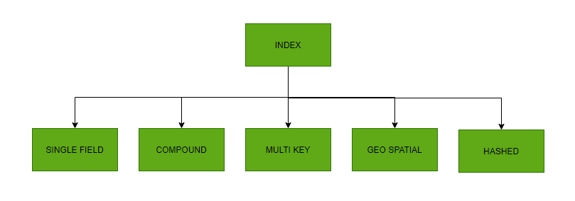
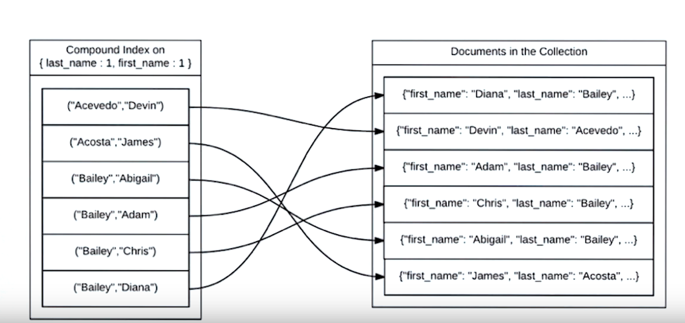

# Les différents types de Mongodb Index

{ style="display: block; margin: 0 auto" }

---

## Single field Mongodb index

### Opération utilisant un seul champ indexé

Comme son nom l’indique, le **single field** mongodb index sert à faire une requête sur **un seul champ d’un document**. Pour créer cet index, il faut utiliser la commande mongo suivante :
```js
db.collection.createIndex( <key and index type specification>, <options> )
```

Par exemple :
```js
db.users.createIndex( { firstName: 1 } )
```

Cette commande permet de **créer** un index sur la collection **users** et sur le champ **firstName** correspondant à son prénom. L’option 1 indique que ce mongodb index classera les prénoms par ordre croissant, ce qui est utile lorsque vous performerez des aggrégations $sort pour classer vos users, dans une page liste de membres par exemple.

Si votre collection users contient **50 000 documents**, le fait de rechercher un document par le champs firstName permettra à votre base de données de faire une recherche sur les mongodb index firstName. Cette recherche performera un **indexScan** et ne parcourra qu’un seul document pour vous retourner le résultat. En revanche, si vous faites une requête sur un autre champ, mongodb sera obligé de faire un **collectionScan**.

Pour un Single Field mongo index, vous pouvez également indexer une sous-propriété de votre document comme ceci :
```js
db.users.createIndex( { location.city: 1 } )
```

### Opération utilisant plusieurs champs

Si vous avez indexé le champ firstName de votre collection Users, vous pouvez tout de même tirer les avantages de cet index lorsque vous faites **des requêtes comportant plusieurs champs**, tant que le champ indexé fait partie des critères.

Par exemple, la recherche suivante :
```js
db.users.find({ firstName: 'Thomas', failedLoginAttempts: {$gte : 3}})
```
Dans ce cas, la requête va utiliser le mongodb index firstName pour récupérer les users ayant le prénom « Thomas » et ensuite parcourir chacun de ces documents pour filtrer uniquement ceux qui ont plus de 3 tentatives de login échouées.

Utiliser un seul mongodb index pour faire des requêtes sur plusieurs champs permet de bénéficier d’une amélioration significative des performances. Pour améliorer encore plus les requêtes comportant plusieurs champs, il existe les **Compound Index**.

### Ordonner ses documents contenant un single field mongodb index

Lors de la création d’un index, il vous est proposé de choisir si votre index doit être **croissant (1)** ou **décroissant (-1)**. Dans le cas d’un single field index, l’ordre importe peu car vous pourrez bénéficier de votre mongodb index dans vos $sort dans les deux sens.

En revanche, l’ordre deviendra important dans le cas des **Compound Index**.

---

## Compound Mongodb index

Dans une utilisation normale de votre application, il est probable que vous ayez besoin de manipuler un document en vous basant sur **plusieurs critères**. Par exemple récupérer les utilisateurs provenant d’une certaine ville et s’étant inscrit il y a moins de 14 jours.

Dans ces cas là, le Compound index est l’outil qu’il faut utiliser. Le Compound Index contient **plusieurs champs dans ses données**.

*Représentation d’un compound mongodb index :*
{ style="display: block; margin: 0 auto" }

Prenons l’exemple de la collection **users** où on aurait indexé le champ **last_name** puis **first_name** via la commande :
```js
db.users.createIndex( { "last_name": 1, "fist_name": 1 } )
```

Dans ce cas, faire une recherche telle que celle qui suis va utiliser le Compound mongodb index et parcourir un seul document pour retrouver notre donnée. 
```js
db.users.findOne({ last_name: "Bailey", first_name:"Chris"})
```

En revanche, une requête telle que la suivante va devoir parcourir l’ensemble de la collection, même si first_name est indexé.
```js
db.users.findOne({first_name:"James"})
```

**L’ordre dans lequel vous définissez les champs dans votre compound index est important**.

### Comprendre les Mongodb Index prefixes

Les **préfixes** sont les **premiers champs** d’un **compound index**. Par exemple, le compound index suivant :
```js
{ "lastName": 1, "firstName": 1, "location.city": 1 }
```
Ce compound index dispose également des index suivants :
```js
{ "lastName": 1, "firstName": 1 }
```
et
```js
{ "lastName": 1 }
```

Une requête comprenant *lastName* et *firstName* ou bien uniquement le *lastName* pourra bénéficier du compound index.

En revanche, une requête contenant *firstName* et *location.city* ou simplement *firstName* ne pourra bénéficier de l’index. Elle devra faire une **collectionScan**.

Enfin, une recherche contenant *lastName* et *location.city* va pouvoir bénéficier de l’avantage du **préfixe** *lastName* comme s’il s’agissait d’un single field mongdb index.

⚠️ **L’utilisation des préfixes vous évitera de créer des index inutilement.**

### Ordonner ses objets grâce aux compound mongodb index

Pour **ordonner** les documents d’une collection, MongoDB va soit utiliser **l’index** si les documents sont ordonnés tels qu’on le souhaite, soit faire une **opération de récupération** des objets et les classer dans la mémoire RAM de votre serveur Mongo.

⚠️ **Pour maximiser les performances, l’utilisation des mongodb index est la solution à privilégier.**

Dans le cas où on souhaite faire un *sort* sur une requête correspondant à un **compound index** ou à un **préfixe**, MongoDB va être en mesure de **parcourir l’index** du début à la fin – ou de la fin au début – pour vous retourner la **collection triée**.

Prenons par exemple le cas d’une collection **users** avec le compound index suivant :
```js
{employer: 1, startDate: -1, lastName: 1, firstName: 1}
```

Une requête telle que :
```js
db.users.find({}).sort({employer:1, startDate: -1})
```
va utiliser le préfixe du compound index et pouvoir retourner la liste des employés classés par ordre alphabétique du nom d’employeur, puis par ordre d’arrivée décroissant dans son entreprise.

Faire un sort en inversant **employer** et **startDate** résultera en une **collectionScan** puis un c**lassement en mémoire serveur**, ce qui est bien plus **coûteux en ressources**.

Une requête peut également bénéficier de préfixe mongodb index lorsque les champs utilisés sont distribués dans l’ordre entre le find et le sort.
Par exemple :
```js
db.users.find({employer: "EDF", startDate: {$gte: "2020-01-01"}}).sort({lastname:1})
```
Cette requête pourra bénéficier du préfixe mongodb index et retourner les users correspondants en bénéficiant de **l’indexScan**.

⚠️ **Un autre élément important à prendre en compte lorsqu’on fait des sort() est de prendre en compte la direction de l’index.**

Dans le cas de notre collection users avec un compound index, si j’effectue un *sort()* en appliquant l’ordre ou son inverse pour chaque champ de l’index ou du préfixe, **la requête utilisera l’index**.

Par exemple, ces requêtes utiliseront **l’index** ou **le préfixe** en parcourant les données de haut en bas :
```js
db.users.find({}).sort({employer: 1, startDate: -1, lastname:1})
```

Si **j’inverse** l’ordre de tous les champs, on bénéficie également de l’avantage de **l’index** ou **du préfixe** puisqu’il va effectuer la lecture de **l’index** en commençant par la fin et remontant vers le début :
```js
db.users.find({}).sort({employer: -1, startDate: 1, lastname:-1})
```
⚠️ **En revanche, si je change le sens pour un seul des éléments, la requête devra faire un collection scan.**
Exemple :
```js
db.users.find({}).sort({ employer: -1, startDate: -1, lastname: 1 })
```

Dans notre cas, si je **change l’ordre d’employer**, la requête devra parcourir **l’ensemble de la collection**. Si je **garde l’ordre d’employer** mais que je **change startDate**, il pourra a utiliser le **préfixe employer** pour réduire le nombre de documents, mais devra faire tout de même un **collectionScan** sur **l’ensemble des documents retournés par le préfixe employer**.

#### Résumé simple

| **sort() utilisé**                        |**Utilise l’index ?**|**Remarques**                      |
|:-:                                        |:-:                  |:-:                                |
|Même ordre que l’index                     |✅ Oui               |Parfait                           |
|Ordre complètement inversé                 |✅ Oui               |Lecture de l’index à l’envers     |
|Un seul champ avec ordre différent         |❌ Non               |Tri cassé, tri en mémoire         |
|Préfixe complet dans bon ordre             |✅ Oui               |Lecture optimisée                 |
|Préfixe complet, sens partiellement inversé|❌ Non               |Lecture partielle, mais tri manuel|

---

## MultiKey Mongodb index

Le **multi-key index** existe lorsque vous souhaitez indexer un champ qui va contenir un *Array*. Pour pouvoir indexer ce champ, MongoDB va créer une clé pour chaque élément que va contenir le tableau, d’où le nom « multi-key » mongodb index.

Dans une collection, il ne peut exister **qu’un seul index** pointant vers un champ qui serait un tableau.

Supposons qu’on a une collection *articles* avec un champ *tags* qui est un tableau de chaînes de caractères.
```js
db.articles.insertMany([
  { title: "Node.js pour les débutants", tags: ["javascript", "backend", "nodejs"] },
  { title: "Introduction à MongoDB", tags: ["mongodb", "nosql", "database"] },
  { title: "Guide CSS complet", tags: ["css", "frontend", "design"] }
])
```

Quand on crée un index sur un champ qui contient un tableau, MongoDB le transforme automatiquement en **index multikey**.
```js
db.articles.createIndex({ tags: 1 })
```

MongoDB va créer une entrée dans l’index pour chaque élément du tableau *tags*.

Par exemple, pour le  document précédent :
```JSON
{
    "title": "...",
    "tags": ["javascript", "backend", "nodejs"]
}
```
MongoDB créera 3 entrées dans l’index : une pour *javascript*, une pour *backend*, et une pour *nodejs*.

⚠️ **On ne peut avoir qu’un seul champ "tableau" indexé par un même index composé.**
Exemple interdit :
```js
db.articles.createIndex({ tags: 1, categories: 1 }) // ❌ Si `categories` est aussi un tableau
```
Pourquoi ? Parce que MongoDB ne sait pas comment combiner les multiples valeurs de deux tableaux dans un seul index sans ambiguïté.

#### Résumé simple

| **Élément**                                           |**Multikey ?**          |**Exemple**                                       |
|:-:                                                    |:-:                     |:-:                                               |
|tags: ["a", "b", "c"]                                  |✅                     |createIndex({ tags: 1 })                          |
|categories: ["x", "y"], tags: ["a", "b"]               |❌ (ensemble)          |createIndex({ categories: 1, tags: 1 }) impossible|

## Text index

Le **Text Index** a pour but de permettre des recherches dans un champ de type *string* ou un *array de strings*. Dans une collection blogPosts par exemple, nous créerions les index text suivants :
```js
db.blogPosts.createIndex( { subject: "text", body: "text" } )
```

---

## ⚠️ Attention à « l’index overhead »

Ajouter **trop d’index inutilement** à sa base de données **nuit aux performances d’écriture**. En effet, à force d’ajouter des index, chaque nouveau document inséré dans la base de données va devoir être traité pour chaque index et peut parfois entraîner la réécriture de tout l’index.

Pour **améliorer les performances** de sa base de données mongo, il est pertinent **d’utiliser le minimum de mongodb index**. Pour nous aider à avoir les meilleures performances tout en maintenant le nombre d’index à son minimum, les mongodb index suivants nous aident à indexer uniquement les données dont on souhaite.

### Partial Mongodb index

Parfois il est pertinent de n’indexer **qu’une partie** des documents de la collection et **non sa totalité**. Le **partial index** tire sa valeur dans les très grandes collections où une proportion significative des requêtes qui y sont faites ne concerne pas toute la collection.

Par exemple une collection transaction regroupe l’ensemble des commandes passées sur un site marchand. Chaque transaction ressemble à ceci :
```JSON
{
    "client": "Chiofalo Vincent",
    "amount": 109997,
    "items": [
        {
            "sku": "27' 4K Monitor",
            "quantity": 1,
            "price": 100000
        }
    ],
    "taxes": 9997,
    "createdAt": "2025-04-17T13:00:00+02:00"
}
```

Cette collection de transactions pourrait représenter** des millions de documents**. Si une des requêtes visant à identifier les clients ayant effectué des achats importants n’a besoin que des noms des clients et du montant de la commande lorsque celle-ci dépasse les 1000€ (soit 100 000 centimes puisqu’en JavaScript les calculs sur les *floats* sont approximatifs), utiliser un **compound index** va indexer toutes les transactions, même celles dont on n’a pas besoin.

Un **partial index** va pouvoir indexer uniquement les transactions correspondant au critère souhaité. Pour créer un **partial index** dans notre cas, on peut utiliser la commande suivante :
```js
db.transactions.createIndex({client: 1, { partialFilterExpression: { amount: { $gt: 100000 } }}})
```

### Sparse Mongodb index

Le s**parse index** est un type de **partial index** où seulement les documents contenant le champ spécifié seront indexés. Pour créer un sparse index :
```js
db.transactions.createIndex({client: 1} , {sparse: true})
```

### TTL Mongodb index

**TTL** est l’acronyme pour **Time To Live**. Cette propriété va permettre de **définir une durée de vie** pour le document. Celui-ci sera automatiquement supprimé une fois cette durée écoulée. Par exemple un log de connexion pourrait être effacé après 1h :
```js
db.log_events.createIndex( { "createdAt": 1 }, { expireAfterSeconds: 3600 } )
```

### Unique Mongodb index

L’index Unique a pour vocation d’empêcher les doublons d’être insérés dans la base. L’exemple le plus évident est celui des users ayant comme prérequis une adresse e-mail unique.
```js
db.users.createIndex({email: 1} , {unique: true})
```

L’index unique peut également s’appliquer à un compound index. Dans ce cas, c’est la combinaison des deux qui doit être unique :
```js
db.users.createIndex({email: 1, role: 1} , {unique: true})
```

En effet, un **user** peut avoir 2 comptes avec la même adresse e-mail, tant que son rôle est différent. Par exemple une même personne peut avoir un compte Uber en tant que chauffeur et en tant que client avec la même adresse e-mail.

### Les index géospatiaux

MongoDB propose également des index permettant de placer des **éléments dans l’espace**. **L’index 2d** permet de placer des coordonnées sur un axe en 2 dimensions, **l’index 2dsphere** permet de placer des coordonnées latitudes-longitudes et **l’index geoHaystack** permet de définir une aire suivant des points sur un axe 2 dimensions.

---

*Sources :*
*- Julien POIRIER*
*- welovedevs*
*- mongodb*
*- wikipedia*