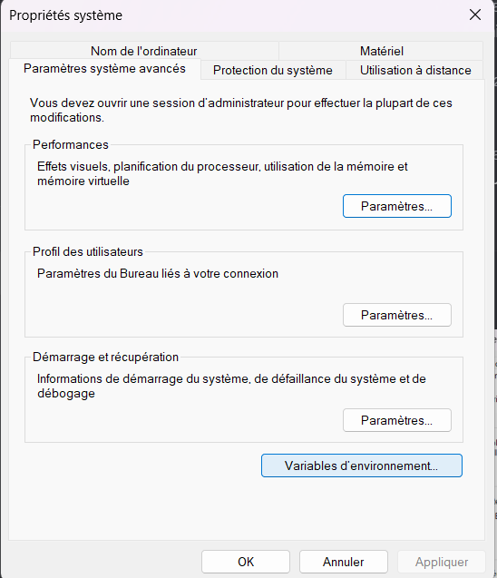
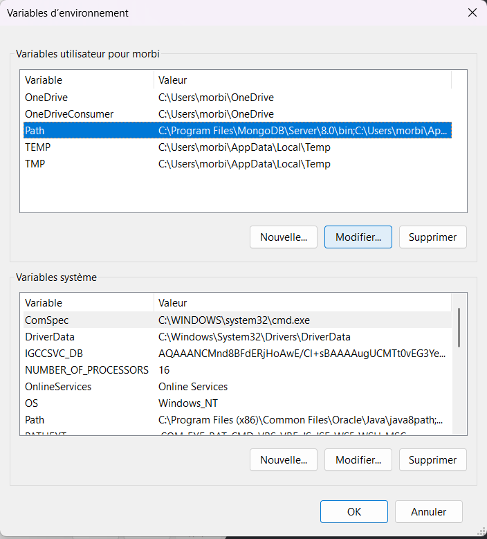
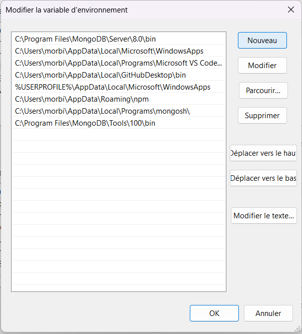

# Installation BDD Mongo DB

## Installation MongoDB Serveur

[Telecharger MongoDB server](https://www.mongodb.com/try/download/community)

Prenez la dernière version avec le package *MSI*.

Suivez les étapes d'installation et décochez *install Compass* .

Dans l'explorateur de fichier, suivez ce chemin :
```arduino
C:\Program Files\MongoDB\Server\8.0\bin
```
*Adaptez la version en fonction de la votre !!*  ==> aller sur disque local et copier le path (chemin) PC LepoleS C:\Program Files\MongoDB\Server\8.0\bin

Vérifiez vos variables d'environnement :

- Recherchez **variables d'environnement** dans la barre de recherche Windows et cliquez dessus !

{ style="display: block; margin: 0 auto" }

- Cliquez en bas sur **Variables d'environnement...** 

- Sélectionnez **Path** et cliquez sur **Modifier...**

{ style="display: block; margin: 0 auto" }

- Si le path précédent n'est pas présent, cliquez sur **Nouveau**

{ style="display: block; margin: 0 auto" }

- Ajouter le path
```arduino
C:\Program Files\MongoDB\Server\8.0\bin
```
*Adaptez la version à la votre !!*

- Cliquez sur *les* **Ok** pour valider

## Installation MongoDB Command Line Database Tools

[Telecharger MongoDB Database Tools](https://www.mongodb.com/try/download/database-tools)

Prenez la dernière version avec le package *MSI*.

Dans l'explorateur de fichier, suivez ce chemin :
```arduino
C:\Program Files\MongoDB\Tools\100\bin
```
*Adaptez la version en fonction de la votre !!*

Refaites la manipe pour le path (avec le bon nouveau path) !!

## Installation Mongosh (MongoDB Shell)

[Telecharger MongoDB Shell](https://www.mongodb.com/try/download/shell)

## Vérification

Ouvrez un terminal et écrivez **mongod** . Si tout est bon, vous devriez avoir des lignes comme :
```bash
{"t":{"$date":"..."},"s":"I",...,"msg":"Waiting for connections","attr":{"port":27017,"ssl":"off"}}
```

Gardez ce terminal ouvert et ouvrez en un de plus. Écrivez **mongosh** . Si tout fonctionne vous devriez voir :
```bash
Current Mongosh Log ID: ...
Connecting to:      mongodb://127.0.0.1:27017/
Using MongoDB:      8.x.x
```
Et vous serez dans la console avec un prompt de type :
```bash
test>
```

## Créer et utiliser une base

Dans la console **mongosh**, tapez :
```js
use dbtest
```
Puis ajoutez une entrée de test :
```js
db.test.insertOne({ hello: "MongoDB" })
```
Regardez si elle est bien enregistrée :
```js
db.test.find()
```
Si vous avez :
```json
{ _id: ObjectId(...), hello: 'MongoDB' }
```
Votre installation est 100 % fonctionnelle 🎉

## Import BDD

Pour importer la base de donnée qui va nous servir à nous exercer, ouvrez un terminal dans le dossier qui contient la db (ici mongo/collection) et entrez ces commandes une à une :
```bash
mongoimport --db ecommerce --collection users --file users.json --jsonArray
mongoimport --db ecommerce --collection products --file products.json --jsonArray
mongoimport --db ecommerce --collection orders --file orders.json --jsonArray
mongoimport --db ecommerce --collection categories --file categories.json --jsonArray
mongoimport --db ecommerce --collection reviews --file reviews.json --jsonArray
```

## Lancer le Mongo Shell

```bash
mongosh
```

## Sélectionner la base

```js
use ecommerce
```

## Test de la base

```js
db.users.find().pretty()
```

Si vous avez un JSON en réponse, c'est tout bon :D !!
Vous pouvez commencer à vous exercer.
Faites les exercices de **niveau 1** et de **niveau 2** (**niveau 3 bonus** - *correction fournis en fin module*) du fichier [exo-queries.md](exo-queries.md)